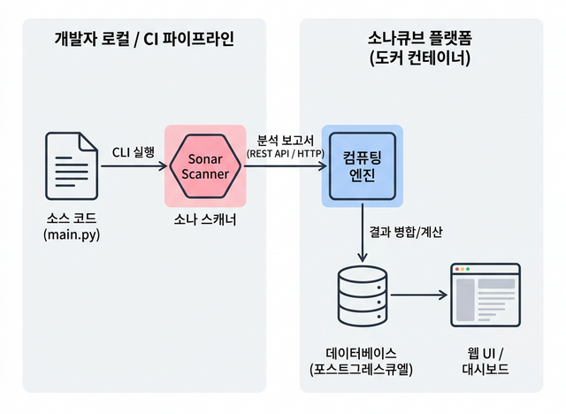

# ⚙️ 02. SonarQube 아키텍처 이해 및 스캐너 연동 (Concept & Scanner)

## 📌 학습 목표 (Goal)
- SonarQube 생태계를 떠받치는 **서버(Server Engine)와 스캐너(Scanner CLI)의 이원화 구조**를 깊이 있게 파악합니다.
- 내 소스코드가 어떻게 분석되어 서버로 전달되는지 내부 통신 원리를 이해합니다.
- `Community` 버전을 넘어 유료 버전인 `Developer/Enterprise`가 제공하는 차별점을 파악합니다.
- 로컬에서 준비한 Python 코드를 스캐너를 통해 밀어넣고 대시보드에서 결과를 육안으로 확인합니다.

---

## 💡 핵심 딥다이브 (Deep-Dive)

### 1. SonarQube 아키텍처 및 내부 요소의 역할

SonarQube 시스템은 단순히 하나의 거대한 프로그램이 아닙니다. 크게 **SonarQube 서버** 와 실제 코드를 핥고(?) 지나가는 **Scanner(분석기)** 로 분리되어 있습니다.



*   **Sonar Scanner (로컬/CI 에이전트):** 코드가 있는 곳, 즉 내 로컬 PC나 Github Actions 러너에서 직접 구동됩니다. 파일들을 읽고 추상 구문 트리(AST)를 분석해 메타데이터 덩어리로 만듭니다.
*   **SonarQube Server (서버):** 로컬에서 스캐너가 보낸 원시 분석 데이터를 수신하는 중앙 컴포넌트입니다.
    *   **Compute Engine:** 스캐너로부터 받은 데이터를 DB의 기존 히스토리 트렌드와 병합하고, 기술 부채 점수를 최종 연산합니다.
    *   **Database:** 분석 결과를 영구 저장합니다.
    *   **Web UI:** 매니저나 개발자가 현재 코드 스멜, 버그를 시각적으로 확인하는 포털입니다.

### 2. 룰셋 동기화 원리: 스캐너는 어떻게 최신 룰을 알까?

Scanner 자체에는 모든 언어의 최신 탐지 규칙이 영구적으로 내장되어 있지 않습니다.
스캐너가 실행되는 순간(`sonar-scanner` 명령어 타격 시), 가장 먼저 **SonarQube Server의 플러그인 매니저와 통신**합니다.

1.  **Handshake:** 스캐너가 서버(ex: `localhost:9000`)에 접속하여 "현재 활성화된 Python 품질 규칙(Quality Profile) 목록을 다오" 라고 요청합니다.
2.  **Download:** 서버는 최신 탐지 플러그인(Analyzer)과 규칙 프리셋을 스캐너 워크스페이스(캐시)로 내려줍니다.
3.  **Execution:** 비로소 로컬 캐시된 최신 룰을 바탕으로 내 코드를 검사하기 시작합니다.

이러한 **중앙 집중형 룰 관리** 덕분에 팀장(Admin)이 서버 대시보드에서 특정 룰을 끄거나 켜면, 수백 명의 소속 개발자 로컬 스캐너에도 즉시 반영됩니다.

### 3. 에디션 비교: Community vs Developer/Enterprise

SonarQube는 엄격한 오픈코어 정책을 취합니다. 기능의 제한표를 정확히 아는 것은 툴 스택 설계의 핵심입니다.

| 기능 분류 | Community (무료) | Developer / Enterprise (유료) |
| :--- | :--- | :--- |
| **분석 대상 브랜치** | **Main(Master) 단일 브랜치만 분석 지원**<br>(다른 브랜칭 워크플로우 분석 불가 정책 강제) | **멀티 브랜치 분석**, Pull Request 장식(Decoration) 지원 |
| **보안 추적 (Taint Analysis)** | 제공되지 않음. <br>(이 한계 때문에 우리는 추후 `Semgrep` 이라는 든든한 SAST 툴을 조합해야 합니다) | 사용자 입력값이 데이터베이스까지 오염시키며 흘러가는지 추적하는 고급 Taint 엔진 활성화 |
| **비중단 통찰 및 알림** | 기본 대시보드 로컬/CI 연동 | PR에 즉각 코멘트를 달아주어 병합 차단 (GitHub 연동 등) |

> 💡 **학습 컨셉:** 우리는 완전 무료 스택을 지향합니다! SonarQube Community가 잡아내지 못하는 취약점 트래킹이나 PR 코멘트는 오픈소스인 **Semgrep** 과 **GitHub Actions** 를 통해 직접 이식하여 유료 버전 못지않은 시스템을 구축할 것입니다.

---

## 🛠 실습 코드 (Hands-on) : 내장 스캐너 구동

이전 단계에서 작성한 `my-secure-app` (main.py 가 있는 폴더) 의 최상단 경로에 스캐너 지시서(Config) 파일을 만듭니다.

### 1. `sonar-project.properties` 파일 생성

```properties
# 파일명: sonar-project.properties
# SonarQube 서버가 이 프로젝트를 알아볼 고유 키값 (유니크해야 함)
sonar.projectKey=secure-python-demo
sonar.projectName=Learning Python Security App

# 소스코드가 위치한 경로 (현재 폴더 . 을 지칭)
sonar.sources=.

# 가상 환경에 스캐너가 침투하여 무의미한 검사를 하는 것을 방지
sonar.exclusions=venv/**, .git/**

# 사용할 프로그래밍 언어의 강제 지정
sonar.python.version=3.10
```

### 2. 브라우저에서 서버 토큰 발급 (선행 작업)

스캐너가 내 코드를 서버에 보낼 때 "아무나" 전송하면 안 되므로 인증 토큰이 필요합니다.

1.  웹 브라우저에서 `localhost:9000` (이전 단계에서 띄운 서버)에 접속합니다 (`admin/admin`).
2.  상단 메뉴 **[My Account]** -> **[Security]** 로 이동.
3.  `Generate Token` 란에 'local_test' 라고 입력 후 **[Generate]** 클릭.
4.  발급된 **알파벳/숫자 조합의 긴 문자열**을 복사해 둡니다.

> ⚠️ 이 토큰은 다시 볼 수 없으므로 생성 즉시 복사해 두는 습관이 중요합니다.

### 3. 로컬 스캐너 실행
자, 이제 로컬 폴더 컴파일된 규칙을 통해 내장 스캐너 (SonarScanner) 단일 환경 컨테이너 이미지를 호출해 분석을 쏴봅니다. (Docker를 활용해 별도 스캐너 설치 없이 1회성 구동)

*(터미널 경로가 `my-secure-app` 임을 확인)*

```bash
# 본인의 고정 토큰값 란에 아까 발급받은 문자열을 덮어씌우세요.
docker run --rm -v "$(pwd):/usr/src" sonarsource/sonar-scanner-cli \
  -Dsonar.host.url=http://host.docker.internal:9000 \
  -Dsonar.login=YOUR_TOKEN_HERE
```
*(💡 `host.docker.internal` 은 스캐너 컨테이너가 띄워져 있는 내 호스트 PC의 9000번 포트 SonarQube 엔진으로 통신을 중계하라는 특수 도메인입니다.)*

터미널에 `EXECUTION SUCCESS` 가 노출되었다면 완벽합니다.

---

## 🚀 마무리 및 다음 단계
SonarQube 대시보드(`localhost:9000`) 홈에 접속해 보세요. 방금 분석 런타임이 수행된 프로젝트(`secure-python-demo`)가 나타나며, 분석 기준 미달(Failed) 알림과 함께 **Bugs, Vulnerabilities, Code Smells** 의 상세 탐지 개수가 집계되어 있을 것입니다.

**다음 단계:** `03-fixing-code-smells.md` 에서는 이 대시보드의 경고(특히 인지적 복잡도 등)를 어떻게 해석하고, 어떻게 "기술 부채(Technical Debt)"를 개발자의 손으로 갚아나가는지 알아보겠습니다.
