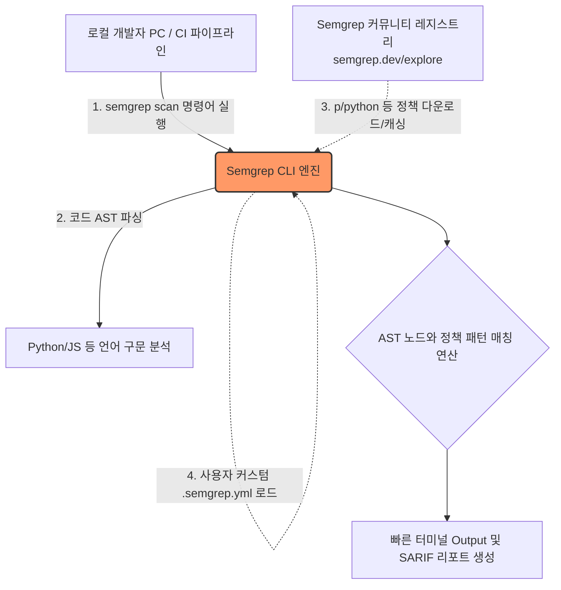

# 🔬 04. Semgrep 개요 및 내장 보안 룰셋 구동 (SAST Basics)

## 📌 학습 목표 (Goal)
- 소스 코드를 문자열이 아닌 **추상 구문 트리(AST)**로 이해하는 SAST의 기본 원리를 이해합니다.
- 속도와 커스터마이징의 끝판왕인 Semgrep의 아키텍처와 유무료 버전을 비교합니다.
- 내장된 보안 표준 룰셋(Registry)을 이용해 우리의 취약한 Python 코드를 스캔해 봅니다.

---

## 💡 핵심 딥다이브 (Deep-Dive)

### 1. 정규표현식(Regex)의 한계와 AST(추상 구문 트리)의 도입
만약 팀에서 "비밀번호 해시로 취약한 `md5` 함수를 쓰지 말라"고 규정했다고 칩시다. 
단순한 텍스트 검색(`grep md5`) 이나 정규표현식은 아래와 같은 상황에서 파탄이 납니다.

*   `import my_custom_md5_module` (오탐지 발생)
*   `""" 이 주석은 md5 알고리즘을 설명합니다 """` (주석까지 오탐지)
*   `import hashlib as h; h.md5()` (변수명이나 에일리어싱 변경 시 미탐지 발생)

**AST (Abstract Syntax Tree)** 엔진 기반인 Semgrep은 코드를 단순한 문자가 아니라, '이건 변수 선언', '저건 함수 호출의 인자' 라는 **구조적 의미의 나무(Tree) 형태**로 완벽하게 파싱한 뒤 구조 자체를 검사합니다. 따라서 주석과 코드, 변수명이 바뀌는 우회수법 등을 완벽하게 구분해냅니다.

### 2. Semgrep 동작 아키텍처 및 룰셋 레지스트리



1.  **Scanner CLI:** Go와 OCaml로 작성되어 미친 듯이 빠릅니다. (수백만 줄 스캔에 몇십 초 단위 소요). SonarQube처럼 무거운 서버를 띄울 필요 없이 그냥 터미널 명령어 하나로 동작합니다.
2.  **규칙 저장소(Registry):** 수많은 보안 전문가와 오픈소스 커뮤니티가 기여한 수천 개의 룰셋 묶음 패키지가 클라우드에 존재하며, 실행 시 즉시 당겨와(Pull) 스캔합니다. (예: `p/python`, `p/owasp-top-ten`)

### 3. 에디션 비교: OSS (Community) vs Team/Pro (유료 SaaS)

| 기능 분류 | OSS (오픈소스 무상) | Team / Pro (상용 에디션) |
| :--- | :--- | :--- |
| **운영 방식** | 완벽한 로컬 CLI 종속, 오프라인 망 구동 가능 | Semgrep Cloud SaaS 대시보드와 중앙 연동 |
| **정책 자산화** | 각 프로젝트별로 `.semgrep.yml` 룰을 커밋해야 함 | 대시보드에서 전 채널 일괄 적용 및 모니터링 관리 |
| **파일 간 추적 분석<br>(Cross-File Taint)** | 단일 파일 단위 매칭 특화 (A에서 발생한 오염이 B파일로 넘어가는 것을 탐지 불가) | A 모듈에서 입력받은 SQL이 B 유틸리티로 넘어가 C DB에 꽂히는 데이터 흐름 분석(Pro 엔진) |
| **Auto-Fix 제안** | 룰 내재 로직 단일 치환 제공 | 유료 AI 기능을 통한 지능형 맥락 기반 복구코드 제안 |

> 💡 **학습 컨셉:** 비록 오픈소스 타 에디션이 파일 간 교차 분석(Deep SAST)에는 한계가 있지만, 단일 파일 내 명시적인 보안/컨벤션 점검(Linting on Steroids 수준)에서는 대체 불가능한 민첩성을 자랑합니다.

---

## 🛠 실습 코드 (Hands-on) : 내장 패턴 매칭 스캔

이전 단계에서 작성된 **의도적인 취약점 및 결함들**을 Semgrep이 AST 모델을 기반으로 어떻게 정확히 식별해내는지 직접 실행해 보겠습니다.

*(터미널 경로가 `my-secure-app` 임을 유지)*

```bash
# 외부 Semgrep 레지스트리에 존재하는 '파이썬(Python) 권장 보안 패키지 룰(p/python)'을
# 현재 디렉터리 하단 전역을 대상으로 스캔합니다.
semgrep scan --config="p/python"
```

실행 후 터미널 출력을 확인해 보세요. 매우 짧은 분석 시간 내에 다음과 같은 3가지 주요 결함을 성공적으로 탐지할 것입니다.

1.  **MD5 해시 사용 탐지 (`hashlib.md5(...)` 구문):** 암호학적 오류 경고.
2.  **SQL 인젝션 탐지:** `cursor.execute(f"SELECT ...")` 내부의 f-string 접합 구문 취약점 적발.
3.  **Hardcoded Credentials:** AWS 토큰 문자열이 변수에 명시된 것을 즉시 감지 (OWASP 기준 위배).

---

## 🚀 마무리 및 다음 단계
이처럼 조직 내 보안 전문가나 커뮤니티가 정립한 검증된 룰셋을 CI 파이프라인이나 로컬 환경에 적용함으로써, 애플리케이션 보안 수준을 획기적으로 높이고 휴먼 에러를 방지할 수 있습니다.

**다음 단계:** 남들이 만든 룰 말고, 우리 회사의 특별한 함수나 특이한 실수 방지를 위해 직접 **"우리 팀만의 Semgrep Rule"** 을 YAML로 어떻게 작성하는지 `05-custom-semgrep-rules.md` 에서 파헤쳐 봅니다.
