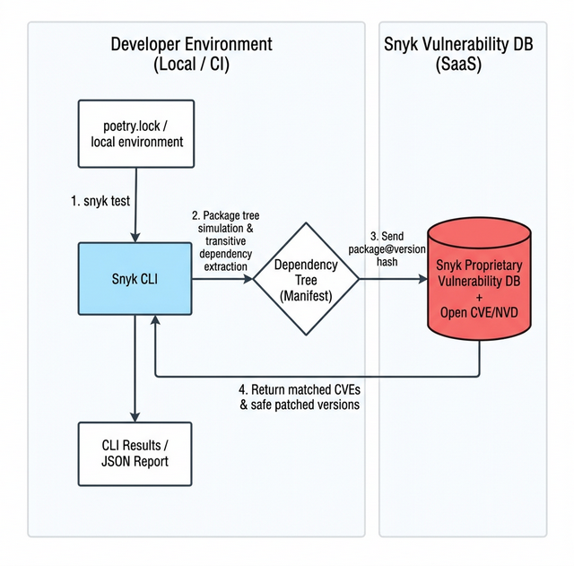

# 📦 06. Snyk 의존성 진단 및 SCA 아키텍처 원리 (Software Composition Analysis)

## 📌 학습 목표 (Goal)
- 현대 소프트웨어 개발에서 90% 공간을 차지하는 오픈소스 라이브러리의 위험성을 이해합니다.
- Snyk의 동작 원리(로컬 트리 빌드 vs 취약점 데이터베이스 매핑)를 다이어그램으로 파악합니다.
- 간접 의존성(Transitive Dependency)이 왜 치명적인 맹점인지 파악하고 Snyk CLI로 스캔해 봅니다.

## 💡 핵심 딥다이브 (Deep-Dive)

### 1. 자체 개발 코드 vs 오픈소스 의존성 비율
현대 애플리케이션은 개발자가 직접 작성한 코드 외에도 `pyproject.toml`과 `poetry.lock`을 통해 가져온 수많은 오픈소스 라이브러리에 의존합니다. SCA(Software Composition Analysis) 도구인 Snyk은 이러한 외부 패키지들에 알려진 보안 취약점(CVE, Common Vulnerabilities and Exposures)이 존재하는지 분석하고 검증하는 역할을 수행합니다.

### 2. Snyk 동작 아키텍처 및 원리

로컬 CLI를 입력하면 단순히 파일 글자만 읽어서 찾는 것이 아니라, 내부적으로 패키지 매니저의 엔진을 백그라운드로 돌려 "의존성 트리"를 직접 조립합니다.



*   **통신 원리:** 내 소스코드(비즈니스 로직) 자체가 Snyk 서버로 전송되는 것이 **아닙니다**. Snyk CLI는 패키지 목록과 버전 정보(메타데이터)만을 추출해 클라우드 DB와 대조(Mapping)하므로 기밀 유출 걱정이 적습니다.

### 3. 간접 의존성(Transitive Dependency)의 위험성
명시적으로 추가한 `A == 1.0` 패키지가 내부적으로 자체 구동을 위해 취약점을 내포한 `B == 0.5` 버전을 사용할 수 있습니다.
직접 `B`를 선언하여 설치하지 않았더라도 애플리케이션은 해당 취약점의 공격 벡터에 노출됩니다. Snyk은 패키지 매니저의 의존성 트리를 파싱하여 이러한 간접 의존성의 단계까지 모두 추적하고 위험을 식별합니다.

### 4. 에디션 비교: Snyk Open Source (무료 vs 유료)

| 기능 분류 | Free (무료 티어) | Team / Enterprise (유료) |
| :--- | :--- | :--- |
| **SCA 스캔 횟수** | 월 200회 제한 (오픈소스 프로젝트는 무제한) | 무제한 스캔 |
| **라이선스 컴플라이언스** | 보안 취약점만 알림 | GPL/AGPL 등 기업에서 쓰면 소송당할법한 전염성 라이선스 동시 적발 |
| **통합 / 가시성** | CLI, 기초 대시보드 | JIRA 티켓 자동 생성, SSO 연동, API Rate Limit 해제 |

---

## 🛠 실습 코드 (Hands-on) : Snyk 스캐닝 시작

> **⚠️ 필수 전제조건 (Prerequisite)** 
> Snyk이 간접 의존성까지 정밀하게 파악하려면, 파이썬 패키지 매니저(Poetry)를 통해 `poetry install` 이나 `poetry add` 작업이 선행되어 의존성 트리(`poetry.lock`)가 확정되어 있어야 합니다. (01단계에서 이미 진행함)

*(터미널 경로가 `my-secure-app` 임을 유지)*

```bash
# 1. 의존성 트리에 어떤 폭탄들이 있는지 Snyk DB와 검사합니다
snyk test

# 2. (옵션) 콘솔 출력이 아닌 Snyk 웹 대시보드로 프로젝트 전체 종속성 지도를 쏴올립니다
snyk monitor
```

### � 스캔 결과 분석
검사가 완료되면 식별된 취약점 목록이 심각도 레벨(Severity)과 함께 터미널에 출력됩니다.
실습을 위해 의도적으로 설치했던 `fastapi==0.85.0`, `uvicorn`, `requests` 구버전 패키지들이 가지는 보안 위협과 연쇄적인 파급 효과를 확인할 수 있습니다.

*   `High Severity`: 10점 만점에 7점 이상짜리 치명적 결함들 (예: Remote Code Execution 가능성, DoS 공격 완벽 노출).
*   `Fixed in`: 이 취약점이 패치된 "정상 버전"이 무엇인지 구체적인 숫자로 가이드라인을 줍니다. (예: `Upgrade fastapi to 0.86.0`)

---

## 🚀 마무리 및 다음 단계
Snyk 스캔 결과를 통해 단순해 보이는 웹 애플리케이션도 내부적으로는 취약한 의존성을 다수 내포할 수 있음을 확인했습니다.

발견된 분석 결과를 토대로 모든 항목을 수동으로 분석하고 수정할 필요는 없습니다.
**다음 단계:** `07-remediating-vulnerabilities.md` 에서는 Snyk이 안내해 준 최적화된 최소 패치 버전을 적용하는 방법과, 즉각적으로 조치할 수 없는 경우 작성하는 예외 처리(Ignore) 전략을 알아봅니다.
