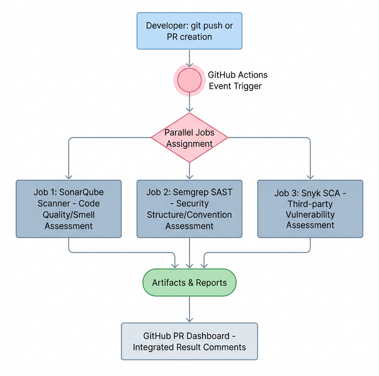

# ⚙️ 08. GitHub Actions 기반 DevSecOps 파이프라인 적용 (CI/CD)

## 📌 학습 목표 (Goal)
- 로컬 환경에서 수동으로 실행하던 3가지 도구(SonarQube, Semgrep, Snyk)를 CI/CD 서버로 이전합니다.
- GitHub Actions Workflow의 동작 원리(Triggers, Jobs, Steps)를 이해하고 병렬 스캐닝 아키텍처를 그립니다.
- 우리의 코드가 `git push` 되는 순간 자동으로 보안 검사가 수행되는 `.yml` 파일 템플릿을 작성합니다.

## 💡 핵심 딥다이브 (Deep-Dive)

### 1. DevSecOps: 개발, 보안, 운영의 톱니바퀴
개발자가 "나는 바쁘니까 보안은 나중에 QA팀이나 보안팀이 하겠지"라고 생각하는 시점(Shift-Right)부터 재앙은 시작됩니다. DevSecOps는 코드를 중앙 브랜치(main)에 합치기 전, **기계(CI/CD)가 사람(개발자)을 대신하여 강제로 보안 검사를 수행하는 자동화된 문화**입니다.

### 2. GitHub Actions 병렬 스캐닝 아키텍처
단일 러너(서버)에서 Sonar -> Semgrep -> Snyk을 순차적으로 돌리면 속도가 너무 느립니다. CI 엔진은 각각의 스캐너를 **독립된 격리 환경(병렬 컨테이너)**에 동시에 띄워 단시간 내에 검증을 끝냅니다.



*   **동작 원리:** 이벤트가 발생하면(`on: push`), GitHub 서버 인프라(Runner)에 Ubuntu/Linux 가상 머신 3대가 동시에 켜집니다. 각 머신은 내 레포지토리의 코드를 체크아웃하고 스캐너를 다운받아 검사를 돌린 결괏값을 중앙 대시보드(PR 뷰)로 쏴줍니다.

---

## 🛠 실습 코드 (Hands-on) : Workflow 작성

프로젝트의 최상단 디렉터리(`my-secure-app`이 아닌 프로젝트 메인 레벨)에 GitHub Action이 인식할 수 있는 약속된 폴더 경로를 생성합니다.

```bash
# Workflow(.yml)가 위치할 필수 디렉터리 규격
mkdir -p .github/workflows
```

새 규칙 파일 `.github/workflows/devsecops-pipeline.yml` 을 생성하고 아래 코드를 덮어씌웁니다.

```yaml
# 파일명: .github/workflows/devsecops-pipeline.yml
name: "DevSecOps Security Pipeline"

# [Trigger] 언제 이 스캐너들을 돌릴 것인가?
on:
  push:
    branches: [ "main", "develop" ]
  pull_request:
    branches: [ "main" ]

jobs:
  # -----------------------------------------------------
  # 1. Semgrep: SAST 보안 로직 스캔 (가장 빠름)
  # -----------------------------------------------------
  semgrep-sast:
    name: Semgrep SAST Scanning
    runs-on: ubuntu-latest
    steps:
      - name: 코드 가져오기 (Checkout)
        uses: actions/checkout@v3
        
      - name: Semgrep 실행 (내장 p/python 룰셋 기반)
        uses: returntocorp/semgrep-action@v1
        with:
          config: "p/python"
          # (옵션) SARIF 포맷 출력으로 GitHub Security Tap과 연동 가능

  # -----------------------------------------------------
  # 2. Snyk: 서드파티 의존성 취약점 스캔
  # -----------------------------------------------------
  snyk-sca:
    name: Snyk SCA Scanning
    runs-on: ubuntu-latest
    steps:
      - name: 코드 가져오기 (Checkout)
        uses: actions/checkout@v3

      - name: 파이썬 환경 셋업
        uses: actions/setup-python@v4
        with:
          python-version: '3.10'
      - name: Poetry 설치 및 의존성 구성
        run: |
          pip install poetry
          cd examples/final-project && poetry install
        
      - name: Snyk 오픈소스 테스트
        uses: snyk/actions/python@master
        env:
          # GitHub Secrets 에 저장된 SNYK 발급 토큰 참조
          SNYK_TOKEN: ${{ secrets.SNYK_TOKEN }}
        with:
          command: test

  # -----------------------------------------------------
  # 3. SonarQube 플랫폼 통신 (예시: SonarCloud 사용 시)
  # -----------------------------------------------------
  sonarqube-quality:
    name: SonarQube Code Quality
    runs-on: ubuntu-latest
    steps:
      - uses: actions/checkout@v3
        with:
          # SonarQube는 변경점 비교를 위해 모든 git 뎁스를 참조해야 함
          fetch-depth: 0  
          
      - name: SonarQube 스캐너 구동
        uses: SonarSource/sonarcloud-github-action@master
        env:
          GITHUB_TOKEN: ${{ secrets.GITHUB_TOKEN }}
          # Sonar 서버(혹은 Cloud) 접속 토큰
          SONAR_TOKEN: ${{ secrets.SONAR_TOKEN }}
```

> **📌 GitHub Secrets 주입하기**
> 레포지토리 `Settings` -> `Secrets and variables` -> `Actions` 메뉴에서 `SNYK_TOKEN` 과 `SONAR_TOKEN` (각 플랫폼에서 발급받은 API 키)을 등록해야만 위 워크플로우가 에러 없이 구동됩니다.

---

## 🚀 마무리 및 다음 단계
이 3개의 심장이 병렬로 뛰는 파이프라인을 구축함으로써, 어떤 주니어가 치명적인 AWS 키를 하드코딩하거나 10년 전 취약한 라이브러리를 PR 해도 **파이프라인이 붉은색 로그를 뿜으며 경고**해 주게 됩니다.

하지만 경고만으로 과연 합병(Merge)을 막을 수 있을까요? 누군가 빨간 불을 무시하고 강제 병합(Force Merge)해 버린다면요?
**다음 단계:** `09-quality-gate-enforcement.md` 에서는 이러한 "경고 무시"를 물리적으로 차단해 버리는 **Build Breaker (Quality Gate)** 설정 전략을 알아봅니다.
